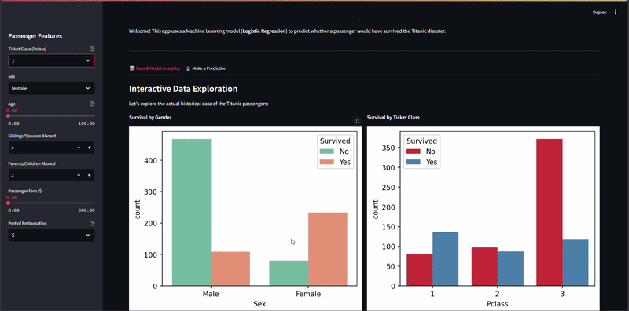
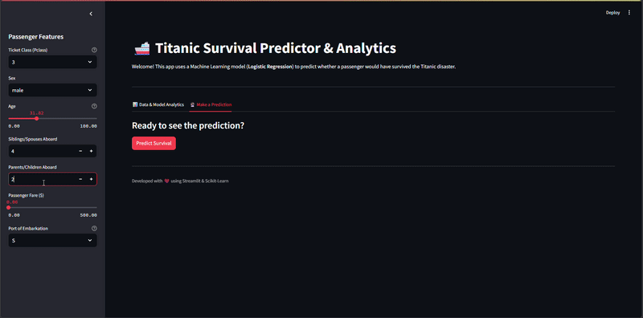
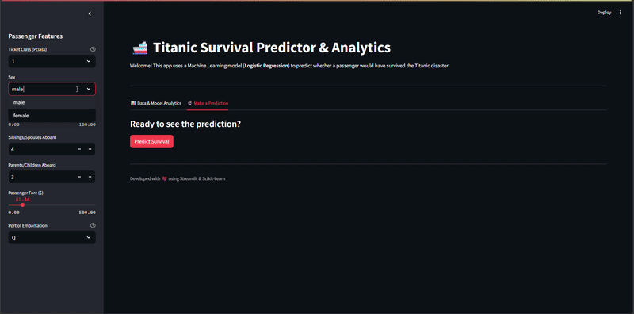

# 🚢 Titanic Survival Predictor & Analytics Dashboard

## 📌 Overview
This project is an interactive web application built with **Streamlit** and **Scikit-Learn**. It utilizes a Machine Learning model (**Logistic Regression**) trained on the famous Titanic dataset to predict the survival probability of a passenger based on their personal information and ticket details.

The app also features an interactive analytics dashboard to explore historical data trends and evaluate model performance.

---


## 🎥 App Demo

### 1️⃣ Analytics & Performance


### 2️⃣ Prediction (Case 1)


### 3️⃣ Prediction (Case 2)


## 🚀 Features

- **Real-time Predictions:**  
  Input passenger features (Age, Sex, Class, etc.) and get immediate survival probabilities.

- **Interactive Analytics:**  
  Dynamic charts for Gender distribution, Age demographics, and Ticket Class statistics.

- **Model Evaluation:**  
  Visualizations of the Confusion Matrix and Feature Importance Heatmap.

- **Optimized Preprocessing:**  
  Robust handling of missing data and feature scaling for accurate predictions.

---

## 🛠️ Tech Stack

- **Language:** Python  
- **Machine Learning:** Scikit-Learn (Logistic Regression)  
- **Data Manipulation:** Pandas & NumPy  
- **Visualization:** Matplotlib & Seaborn  
- **Web Framework:** Streamlit  

---

## 📂 Project Structure

```
├── titanic_app.py      # Main Streamlit web application
├── titanic_project.py  # Training, evaluation, and logic script
├── train.csv           # Titanic dataset (Source data)
├── model.pkl           # Saved Logistic Regression model
├── scaler.pkl          # Saved StandardScaler object
├── requirements.txt    # List of dependencies
└── assets/             # Demo GIFs and images
```

---

## 💻 How to Run Locally

### 1. Clone the repository
```bash
git clone https://github.com/HASOOON777/Titanic.git
cd Titanic
```

### 2. Install requirements
```bash
pip install -r requirements.txt
```

### 3. Run the app
```bash
streamlit run titanic_app.py
```

---

## 👨‍💻 Author

**Hassoooon | AI & Data Science**  

Developed with ❤️ by Hassoooon.
